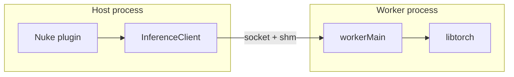

# nuketorch

Reusable IPC and POSIX shared-memory infrastructure for **Nuke NDK** plugins that run **libtorch** inference in a separate worker process.

## Architecture

The Nuke plugin links **nuketorch** (no libtorch). A companion executable links **libtorch + nuketorch** and performs inference. They communicate over a Unix domain socket; frame data uses shared memory.



## Requirements

- C++17, CMake 3.25+
- Linux (POSIX `shm_open` / `mmap`, Unix domain sockets)

## Build and test

```bash
cmake -B build -S . -DBUILD_TESTING=ON
cmake --build build -j"$(nproc)"
ctest --test-dir build
```

To skip unit tests when this project is pulled in as a dependency, set `NUKETORCH_BUILD_TESTING=OFF` before adding the subdirectory (see nnRetime).

## Consume in your project

### libtorch auto-download

`cmake/FetchLibtorch.cmake` (also installed under `lib/cmake/nuketorch/`) can download a libtorch zip from `download.pytorch.org` before `find_package(Torch)` when `LIBTORCH_ROOT` is empty and Torch is not already on `CMAKE_PREFIX_PATH`.

```cmake
list(APPEND CMAKE_MODULE_PATH "${nuketorch_SOURCE_DIR}/cmake")  # or installed prefix .../lib/cmake/nuketorch
include(FetchLibtorch)
find_package(Torch REQUIRED)
```

Typical cache variables:

```bash
cmake -B build -DTORCH_VERSION=2.10.0 -DCUDA_VARIANT=cu130
```

Override with a local tree: `-DLIBTORCH_ROOT=/path/to/libtorch`.

### Option A: `add_subdirectory` / FetchContent (local path)

```cmake
set(NUKETORCH_BUILD_TESTING OFF)  # optional, when embedding
FetchContent_Declare(nuketorch SOURCE_DIR "${CMAKE_CURRENT_SOURCE_DIR}/../nuketorch")
FetchContent_MakeAvailable(nuketorch)

target_link_libraries(my_plugin PRIVATE nuketorch::nuketorch)
target_link_libraries(my_worker PRIVATE nuketorch::nuketorch ${TORCH_LIBRARIES})
```

### Option B: Install and `find_package`

```bash
cmake --install build --prefix /path/to/prefix
```

```cmake
find_package(nuketorch REQUIRED)
target_link_libraries(my_plugin PRIVATE nuketorch::nuketorch)
```

## Library layout (public headers)

| Header | Role |
|--------|------|
| [`include/nuketorch/IPC.h`](include/nuketorch/IPC.h) | Length-prefixed messages over Unix stream sockets |
| [`include/nuketorch/SharedMemoryBuffer.h`](include/nuketorch/SharedMemoryBuffer.h) | POSIX shared memory segments |
| [`include/nuketorch/Protocol.h`](include/nuketorch/Protocol.h) | Binary encode/decode of `InferenceRequest` |
| [`include/nuketorch/InferenceClient.h`](include/nuketorch/InferenceClient.h) | Fork worker, push frames, wait for result |
| [`include/nuketorch/WorkerHarness.h`](include/nuketorch/WorkerHarness.h) | `workerMain` IPC loop for worker executables |
| [`include/nuketorch/ImageUtils.h`](include/nuketorch/ImageUtils.h) | Planar float copy with vertical flip (Nuke scanline order) |

See [`docs/writing-a-plugin.md`](docs/writing-a-plugin.md) for an end-to-end integration guide.

## License

No license file is bundled yet; add one when you publish or redistribute.
