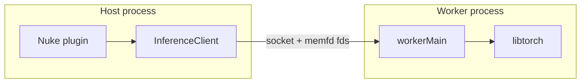

# nuketorch

Reusable IPC and shared-memory infrastructure for **Nuke NDK** plugins that run **libtorch** inference in a separate worker process.

## Architecture

The Nuke plugin links **nuketorch** (no libtorch). A companion executable links **libtorch + nuketorch** and performs inference. Control messages travel over a Unix domain socket; frame data lives in anonymous `memfd` shared-memory segments whose file descriptors are passed with each request (`SCM_RIGHTS`), so nothing is exposed in a global namespace and the kernel reclaims everything after a crash on either side.


```mermaid
graph LR
  subgraph host [Host process]
    Plugin[Nuke plugin]
    Client[InferenceClient]
    Plugin --> Client
  end
  subgraph worker [Worker process]
    Main[workerMain]
    Torch[libtorch]
    Main --> Torch
  end
  Client -->|socket + memfd fds| Main
```

Robustness properties:

- The worker is spawned with `posix_spawn` (no `fork()` hazards inside a heavily threaded host).
- Every request carries an id; a timed-out control reply can never desynchronize the stream.
- Worker stderr is captured and its tail is attached to error messages, so a worker that dies during startup (missing shared library, bad CUDA setup) produces a self-diagnosing exception.
- `InferenceConfig::frame_timeout_ms` arms a per-frame watchdog (kill + `TimeoutError`); cancellation is cooperative via a shared flag the worker can poll (`WorkerContext::cancelled`).
- All failures throw typed exceptions (`Errors.h`) that also map to stable codes in the C API.
- After a worker death, `start()` on the same client fully recovers.

## Requirements

- C++17, CMake 3.25+
- Linux (Unix domain sockets, `memfd_create`, `posix_spawn`)

## Build and test

```bash
cmake -B build -S . -DBUILD_TESTING=ON
cmake --build build -j"$(nproc)"
ctest --test-dir build
```

To skip unit tests when this project is pulled in as a dependency, set `NUKETORCH_BUILD_TESTING=OFF` before adding the subdirectory (see nnRetime).

Fuzz harnesses for the wire parsers build with `-DNUKETORCH_BUILD_FUZZERS=ON` (Clang only).

## Consume in your project

### libtorch auto-download

`cmake/FetchLibtorch.cmake` (also installed under `lib/cmake/nuketorch/`) can download a libtorch zip from `download.pytorch.org` before `find_package(Torch)` when `LIBTORCH_ROOT` is empty and Torch is not already on `CMAKE_PREFIX_PATH`.

```cmake
list(APPEND CMAKE_MODULE_PATH "${nuketorch_SOURCE_DIR}/cmake")  # or installed prefix .../lib/cmake/nuketorch
include(FetchLibtorch)
find_package(Torch REQUIRED)
```

Typical cache variables:

```bash
cmake -B build -DTORCH_VERSION=2.10.0 -DCUDA_VARIANT=cu130
```

Override with a local tree: `-DLIBTORCH_ROOT=/path/to/libtorch`.

### Option A: `add_subdirectory` / FetchContent (local path)

```cmake
set(NUKETORCH_BUILD_TESTING OFF)  # optional, when embedding
FetchContent_Declare(nuketorch SOURCE_DIR "${CMAKE_CURRENT_SOURCE_DIR}/../nuketorch")
FetchContent_MakeAvailable(nuketorch)

target_link_libraries(my_plugin PRIVATE nuketorch::nuketorch)
target_link_libraries(my_worker PRIVATE nuketorch::nuketorch ${TORCH_LIBRARIES})
```

### Option B: Install and `find_package`

```bash
cmake --install build --prefix /path/to/prefix
```

```cmake
find_package(nuketorch REQUIRED)
target_link_libraries(my_plugin PRIVATE nuketorch::nuketorch)
```

## Library layout (public headers)

| Header | Role |
|--------|------|
| [`include/nuketorch/InferenceClient.h`](include/nuketorch/InferenceClient.h) | Spawn worker, push frames (copy or zero-copy mapped), timeouts, cancel |
| [`include/nuketorch/WorkerPool.h`](include/nuketorch/WorkerPool.h) | Share one worker (and one model on the GPU) across node instances in a process |
| [`include/nuketorch/WorkerHarness.h`](include/nuketorch/WorkerHarness.h) | `workerMain` IPC loop for worker executables |
| [`include/nuketorch/Errors.h`](include/nuketorch/Errors.h) | Typed exceptions + stable error codes |
| [`include/nuketorch/IPC.h`](include/nuketorch/IPC.h) | Length-prefixed messages + fd passing over Unix stream sockets |
| [`include/nuketorch/SharedMemoryBuffer.h`](include/nuketorch/SharedMemoryBuffer.h) | Anonymous memfd segments shared by descriptor |
| [`include/nuketorch/Protocol.h`](include/nuketorch/Protocol.h) | Binary encode/decode of `InferenceRequest` (protocol v2) |
| [`include/nuketorch/ImageUtils.h`](include/nuketorch/ImageUtils.h) | Planar float copy with vertical flip (Nuke scanline order) |
| [`include/nuketorch/nuketorch_c.h`](include/nuketorch/nuketorch_c.h) | C API (opaque handle, error codes) |
| [`include/nuketorch/FreezeDebug.h`](include/nuketorch/FreezeDebug.h) | Opt-in fsync-per-line freeze logger (`NUKETORCH_FREEZE_LOG=<path>`) |

Worker-side torch helpers (TorchScript / AOTInductor / optional TensorRT backends) live under `include/nuketorch/torch_worker/` and build with `-DNUKETORCH_BUILD_TORCH_WORKER=ON`. Precision is selectable per frame via `params["precision"]`: `half` (full FP16 conversion, the `mixed_precision` default), `autocast` (FP32 weights, per-op FP16 — real mixed precision, TorchScript on CUDA), or `float32`. The worker caches frame mappings across requests, so steady-state frames cost no mmap.

See [`docs/writing-a-plugin.md`](docs/writing-a-plugin.md) for an end-to-end integration guide.

## Compatibility

Protocol v2 (0.2.0) is a clean break from v1: the client and worker verify versions during the `READY` handshake and refuse mismatched pairs with a clear error. Rebuild worker binaries when upgrading. The metrics format tolerates unknown keys, so adding metrics does not break older hosts.

## License

No license file is bundled yet; add one when you publish or redistribute.
